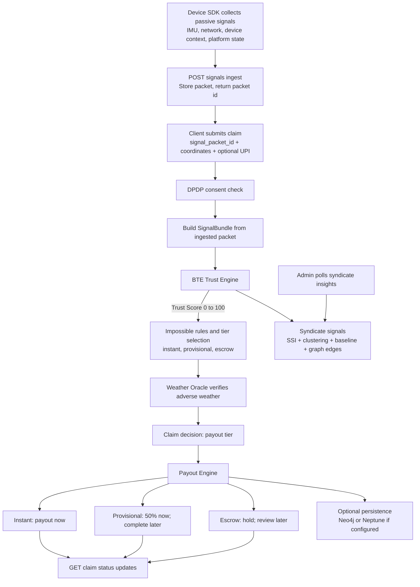

# VIGIL — Verified Intelligence for Gig Insurance Legitimacy

> Parametric micro-insurance for gig economy workers. Instant weather-triggered payouts protected by a multi-signal Behavioral Trust Engine (BTE) against GPS spoofing fraud.

## 🌟 How It Works

The worker’s claim becomes valid only when **(1)** adverse weather is verified for the claimed coordinates and **(2)** the worker’s signals show realistic, convergent behavior consistent with being in motion during bad weather.

### End-to-End Flow (Implementation)



## 🚨 Differentiation: Genuine vs Bad Actor (Anti-Spoofing)

**Key idea:** a GPS spoofing app can often forge *coordinates*, but it cannot reliably forge the *convergence* of:
1) physical motion patterns (IMU / steps / rotation events),
2) network movement reality (cell handoffs and signal variance),
3) device context consistency (battery drain, app state, screen interaction),
4) platform reality (recent order activity),
5) and ring-level coordination signals (temporal clustering + fingerprint co-occurrence).

### Impossible Combination Escalation

Even if a worker’s Trust Score looks acceptable, a claim is escalated when **two or more** “impossible” conditions occur together:
- **Home Wi-Fi + claimed storm-zone presence** (Wi-Fi probe indicates a residential SSID while coordinates indicate a red-alert zone)
- **Claimed movement + stationary IMU behavior** (accelerometer variance too low, step delta indicates no activity)
- **No realistic network movement** (e.g., missing/implausible cell handoffs while coordinates imply travel)

This prevents “single-signal” spoofing from succeeding at scale.

## 📊 Data: What Signals Are Used (Beyond GPS)

VIGIL analyzes **9 passive signal layers** at claim time:

### Layer 1: IMU (Inertial Measurement Unit)
- Accelerometer variance (motion/vibration expected in real storm navigation)
- Gyroscope rotation events (turns/navigation vs stationary)
- Step counter delta (zero steps for extended periods reduces plausibility)

### Layer 2: Network & Cell Infrastructure
- Cell tower handoff sequence (movement yields multiple handoffs)
- Wi‑Fi SSID probe list signals (home/residential SSIDs indicate at-home behavior)
- Signal strength variance (dynamic RSSI during movement vs stable home placement)

### Layer 3: Device Context
- App foreground/background state (delivery workflow consistency)
- Battery drain rate delta (active navigation + radio usage drains battery)
- Screen interaction cadence (pickup/confirm/navigation usage vs spoof-only behavior)

### Layer 4: Order Platform Cross-Validation (Oracle)
- Last order completion timestamp (recent active work vs long idle)
- Active order presence at claim time

### Layer 5: Syndicate Graph Detection (Ring Breaker)
- Temporal claim clustering (burst windows indicate coordination)
- Device fingerprint co-occurrence graph (same spoof toolkit/device attributes appearing together)
- Staggered trigger detection (spacing ~30 minutes apart to evade burst filters)
- Behavioral baseline flags (repeated at-home-like claim patterns over time)

## 🛠️ Implementation (Modules + Endpoints)

### Key backend endpoints
- `POST /api/signals/ingest`  
  Ingest raw device packets (from a real mobile SDK). Returns `packet_id`.
- `POST /api/claims/submit`  
  Creates a claim using `signal_packet_id`, runs BTE + weather verification, triggers payout tier logic.
- `GET /api/claims/{claim_id}`  
  Returns up-to-date payout status for provisional/escrow flows.
- `GET /api/claims/recent`  
  Used by admin UI.
- `POST /api/claims/{claim_id}/media`  
  Optional Tier-3 evidence upload (demo stores metadata only).
- `GET /api/syndicate/insights`  
  Clustering, staggered triggers, baseline flags, and graph edge summaries.
- `GET /api/weather/at`  
  Weather Oracle view for claimed coordinates.

### DPDP consent enforcement (server-side)
Set:
- `REQUIRE_CONSENT=true`

Clients must send:
- Header: `x-vigil-consent: accepted`

### Weather Oracle
- Uses OpenWeatherMap if `OPENWEATHER_API_KEY` is set
- Always has a deterministic mock fallback for local development

### Persistence (Neo4j / Neptune)
- `PERSISTENCE_BACKEND=neo4j` (with `NEO4J_URI`, `NEO4J_USER`, `NEO4J_PASSWORD`)
- `PERSISTENCE_BACKEND=neptune` (with `NEPTUNE_SPARQL_ENDPOINT`)

If graph connectivity is not configured, the system safely falls back to in-memory storage.

### Razorpay/UPI payouts
- Real payouts only attempt when Razorpay keys + a UPI handle are present:
  - `RAZORPAY_KEY_ID`
  - `RAZORPAY_KEY_SECRET`
  - `DEFAULT_WORKER_UPI` or an explicit `upi_handle`

## 🚀 Quick Start

```bash
# One-time setup
npm install
cd frontend && npm install && cd ..
pip install -r backend/requirements.txt

# Start both backend + frontend with one command
npm run dev
```

Then open **http://localhost:3000** (or whatever port Next prints if 3000 is in use).

## 📁 Project Structure

```
devt/
├── backend/           # FastAPI — BTE, Weather Oracle, Claim Validator, payout/persistence
├── frontend/          # Next.js — Worker claim UI, admin insights UI
├── shared/            # Shared types and constants (placeholder in this prototype)
└── docs/              # Architecture & design docs (optional)
```

## 📄 License

MIT — open core, proprietary BTE model weights
